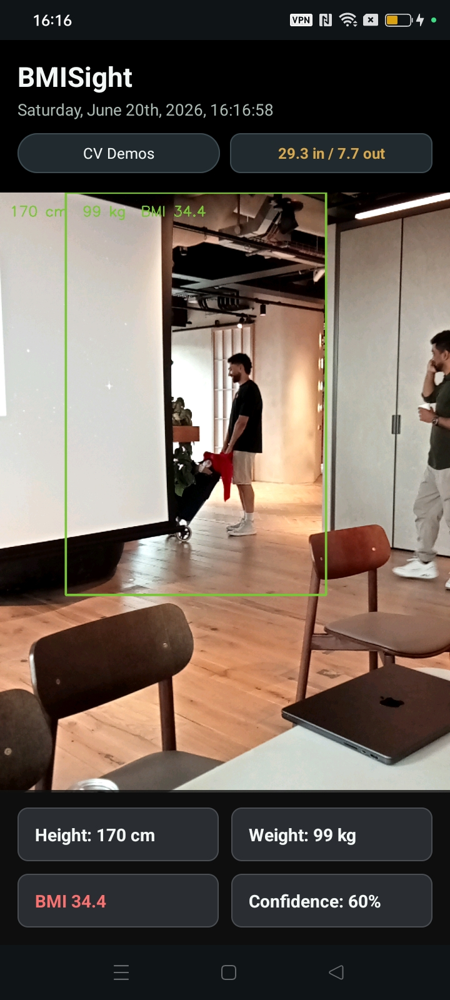

# BMISight

**Real-time body metrics, estimated live from your phone's camera.**



BMISight is an Android app that uses the device camera and on-device computer vision (OpenCV, via JNI/C++) to estimate a person's height, weight, and BMI in real time, with a live confidence score and a set of classic computer-vision algorithm demos built on the same camera pipeline.

> ⚠️ **Not a medical device.** Height, weight, and BMI values are heuristic estimates derived from a 2D camera image with no depth sensor, reference object, or calibration of any kind. They are intended for demonstration purposes only — see [Known Limitations](#known-limitations) below.

---

## Features

- **Full-screen live camera preview** with a translucent overlay UI (no separate "viewfinder box" — the camera *is* the app).
- **Real-time body detection** — edge detection + contour analysis locates a person-shaped silhouette in frame and draws a bounding box around it.
- **Live metrics panel** — height, weight, BMI, and a detection-confidence percentage, all updating continuously while a person is framed.
- **BMI color coding** — the BMI number renders green or red depending on whether it crosses the clinical obesity threshold (30).
- **Pinch-to-zoom** — standard two-finger pinch gesture zooms the camera in/out using the device's digital zoom range.
- **CV Demos menu** — switch the live feed between several classic computer-vision algorithms (edge detection, contour extraction, optical flow, ORB feature matching) to see the building blocks in action.
- **Live clock subtitle** — the header displays the current day/date/time, updating once per second.

## Tech Stack

| Layer | Technology |
|---|---|
| UI / app logic | Kotlin, ViewBinding, Material Components, ConstraintLayout |
| Camera capture | Camera2 API (no CameraX) |
| Image processing | OpenCV (C++), invoked via JNI |
| Native build | CMake + the Android NDK |
| Build system | Gradle (Kotlin DSL) |

## Architecture Overview

```
MainActivity            – wires everything together: camera lifecycle, zoom gesture,
                           live metrics callback, CV Demos menu, clock
GoblinCameraEngine       – owns the Camera2 session, exposes onZoom() for pinch-to-zoom
GoblinImageEngine        – YUV→RGB conversion, threading, FPS tracking, dispatches
                           frames to native code and results back to the UI
GoblinSurfaceView        – custom SurfaceView that renders processed frames
ImageProcessorWrapper    – Kotlin/JNI bridge to the native image processor
ImageProcessor (C++)     – frame rotation, mode dispatch, and the body-metrics
                           estimation pipeline (Canny → contour → bounding box →
                           heuristic height/weight/BMI mapping, with temporal
                           smoothing across frames)
mills/                   – individual CV algorithm implementations (Canny edges,
                           contours, optical flow, ORB features, etc.), coordinated
                           by MillEngine and exposed through the CV Demos menu
```

## Requirements

- Android Studio (recent stable release)
- Android SDK with platform **34** installed
- Android NDK (any side-by-side version Gradle resolves; tested with r25 and r27)
- CMake **3.22.1** (installed via the SDK Manager's CMake component)
- **OpenCV Android SDK** — the native/C++ distribution (not just the Java bindings), unzipped locally. The build expects the `staticlibs/` folder, so make sure you grab the prebuilt SDK release rather than a source checkout.
- A physical Android device is recommended over an emulator for the body-metrics feature, since it needs a real camera feed and an actual person in frame to produce meaningful results.

## Setup

1. **Clone the repo.**

2. **Point the native build at your OpenCV SDK.** Open `app/src/main/cpp/CMakeLists.txt` and update:
   ```cmake
   set(OPENCV_DIR /path/to/your/OpenCV-android-sdk/sdk/native)
   ```
   The path must end in `OpenCV-android-sdk/sdk/native`.

3. **Let Android Studio set up `local.properties`.** This file is machine-specific and excluded from version control — Android Studio regenerates it automatically on first project sync, pointing at your local Android SDK.

4. **Open the project in Android Studio** and let Gradle sync. The first build will be slow, since it compiles the native library against OpenCV for four ABIs (`arm64-v8a`, `armeabi-v7a`, `x86`, `x86_64`).

5. **Run on a device.** Grant the camera permission when prompted. Stand back far enough that your full body is in frame — the live metrics panel only populates once detection confidence clears an internal threshold; otherwise it shows a "frame full body" state.

### Troubleshooting

- **CMake/native build fails immediately** — almost always the `OPENCV_DIR` path in `CMakeLists.txt` pointing somewhere that doesn't exist on your machine.
- **Gradle sync fails on SDK/NDK** — check that the `compileSdk` version in `app/build.gradle.kts` has a matching platform installed (`Android SDK Platforms` in the SDK Manager), and that an NDK version is installed (`SDK Tools > NDK`).
- **Resource linking errors mentioning a missing `string/...`** — a layout file references a string resource that isn't defined in `strings.xml`; check for naming mismatches between the two.
- **Native code changes not taking effect** — `Build > Clean Project` forces a full native rebuild; sometimes the incremental CMake/Ninja cache doesn't pick up `.cpp` edits on its own.

## Known Limitations

This project trades accuracy for a self-contained, dependency-light demo. Specifically:

- **No depth sensing or scale calibration.** Height is estimated purely from what fraction of the camera frame a detected silhouette occupies — there's no reference object, second camera, or distance sensor involved. Moving closer to or further from the camera will shift the estimate.
- **No real pose or body-segmentation model.** Detection is a classical Canny-edge + contour-bounding-box pipeline, not a trained ML model. It's sensitive to lighting, background clutter, and clothing that blends into the background.
- **Weight and BMI are derived from apparent body proportions** (width-to-height ratio of the detected box), not measured tissue composition — two people of the same apparent build will get similar numbers regardless of actual body composition.
- **Temporal smoothing reduces jitter, not error.** Frame-to-frame averaging keeps the displayed numbers from swinging wildly while standing still, but doesn't make the underlying estimate more *accurate* — only more *stable*.
- **Camera zoom affects framing-dependent estimates.** Pinch-zooming changes the effective field of view, which can shift results for the same reason distance does.

In short: convincing for a demo, not suitable for any health, fitness, or medical use case.

## Possible Future Improvements

- Swap the heuristic contour-based detector for a trained pose-estimation or body-segmentation model (e.g., via TensorFlow Lite or MediaPipe).
- Add a calibration step using a known reference object or marker to convert pixel measurements into real-world units.
- Expose the smoothing constants (currently hardcoded in `ImageProcessor.cpp`) as user-adjustable settings.
- Persist a measurement history rather than only showing the current live estimate.

## License

See the [`LICENSE`](./LICENSE) file in this repository.